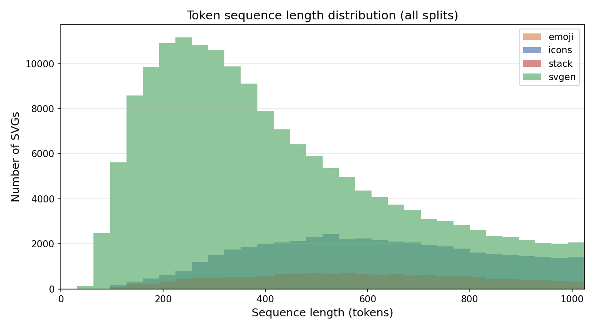
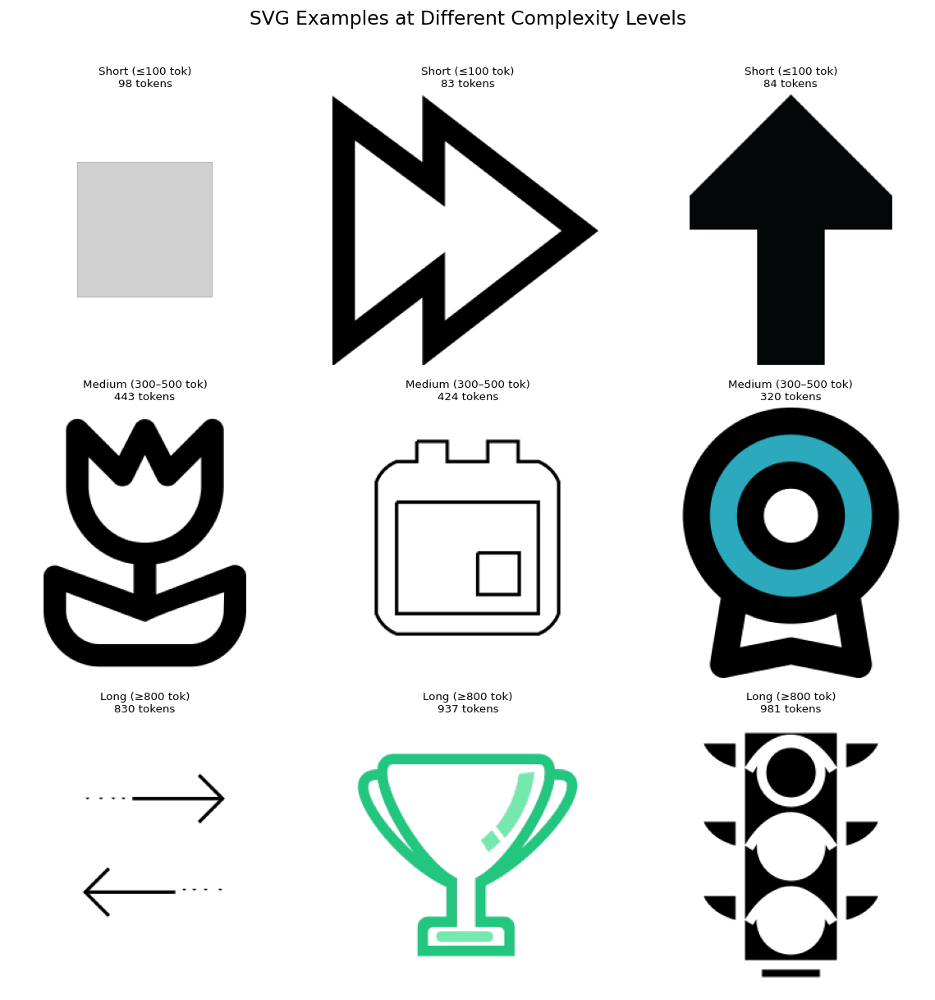

# Part 1: Data Collection and Preprocessing

## Dataset Sources

### Raw downloads
| Source | Dataset | Files downloaded |
|--------|---------|-----------------|
| icons  | starvector/svg-icons-simple  | 80,434 |
| emoji  | starvector/svg-emoji-simple  | 4,114  |
| svgen  | umuthopeyildirim/svgen-500k  | 216,435 |
| stack  | starvector/svg-stack-simple (streamed) | 20,000 |
| **Total** | | **320,983** |

### After cleaning
| Source | Before | After | Dropped (too long) | Dropped (XML err) |
|--------|--------|-------|-------------------|-------------------|
| icons | 80,434 | 76,292 | 4,142 | 0 |
| emoji | 4,114 | 3,563 | 551 | 0 |
| svgen | 216,435 | 206,660 | 9,760 | 15 |
| stack | 20,000 | 20,000 | 0 | 0 |
| **Total** | **320,983** | **306,515** | **14,453** | **15** |

## Tokenizer

- **Library**: HuggingFace `tokenizers` (BPE with ByteLevel pre-tokenizer)
- **Chosen vocab size**: 4,096
- **Special tokens**: `<|endoftext|>`, `<unk>`
- **Training corpus**: all cleaned SVGs (~378 MB)

### Vocab size comparison (trained independently at each size)

| Vocab | Avg seq len | Median seq len | SVGs >1024 tok | Est. train tokens |
|-------|------------|----------------|----------------|-------------------|
| 1,024 | 780.4 | 557 | 24.9% | 219,126,963 |
| 2,048 | 770.6 | 551 | 24.3% | 216,386,673 |
| 4,096 | 766.5 | 548 | 24.1% | 215,213,049 |
| 8,192 | 765.2 | 546 | 24.1% | 214,858,306 |

**Justification**: Sequence length plateaus after 4,096 (766 vs 765 tokens at 8,192). Choosing 4,096 halves the embedding table size with negligible impact on sequence length. ByteLevel BPE guarantees 0% UNK rate at any vocab size.

## Dataset Splits (98 / 1 / 1)

| Split | SVGs | Tokens | Sources |
|-------|------|--------|---------|
| train | 224,150 | 104,827,356 | emoji=956, icons=45,438, stack=14,159, svgen=163,597 |
| val | 2,287 | 1,070,505 | emoji=6, icons=449, stack=120, svgen=1,712 |
| test | 2,288 | 1,065,623 | emoji=10, icons=453, stack=128, svgen=1,697 |

- **Split method**: by file count (not token position) — prevents data leakage
- **Max sequence length**: 1,024 tokens (exact, post-tokenization filter)
- **Training token total**: 104,827,356 (104.8M) ✓

## Sequence Length Distribution

## SVG Examples at Different Complexity Levels

| Complexity | Token range | Description |
|-----------|-------------|-------------|
| Short     | ≤ 100       | Simple icons: single path or basic shape |
| Medium    | 300–500     | Moderate detail: multiple paths, some attributes |
| Long      | ≥ 800       | Complex icons: many paths, rich attributes |

## Design Decisions

| Decision | Choice | Justification |
|----------|--------|---------------|
| Token threshold | 1,024 | Fits small model context windows; removes outliers |
| Vocab size | 4,096 | Seq length plateau after 4K; halves embedding vs 8K |
| Split ratio | 98/1/1 | Maximises training data; val/test each ~1K SVGs for reliable metrics |
| Split method | By file | Avoids token-position leakage between splits |
| Coord precision | 1 decimal | Reduces float vocabulary without visual quality loss |