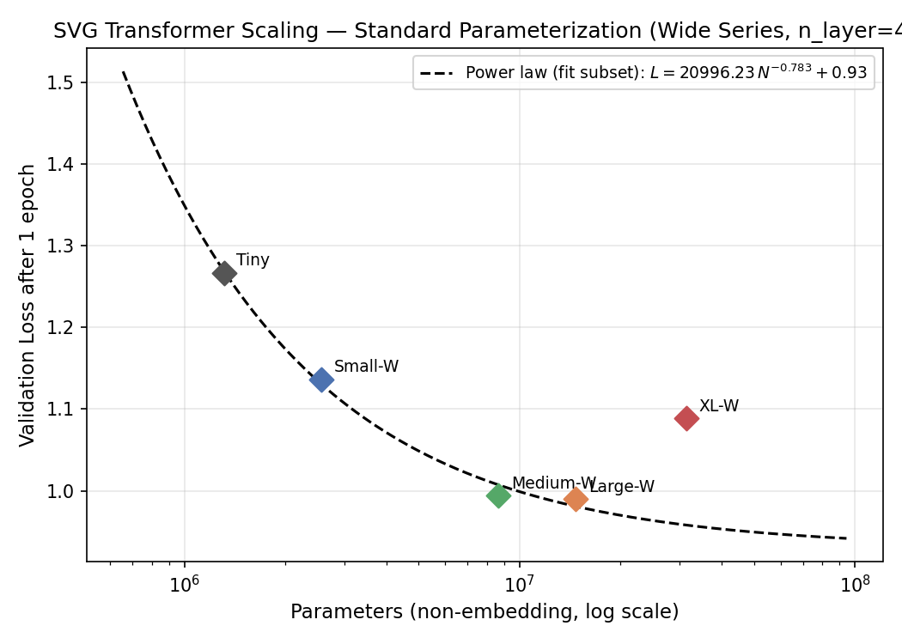
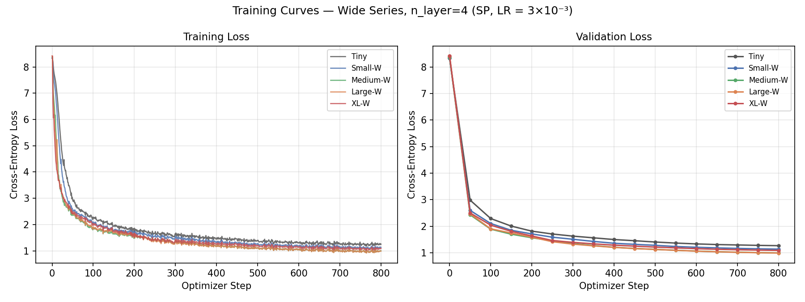

# Part 2: Transformer Scaling Study — Results

## Model Architectures

### Original Series (width + depth scale together)

| Name   | Params (non-emb) | d_model | n_layers | n_heads | d_ff |
|--------|------------------|---------|----------|---------|------|
| Tiny   | 1.31M            | 128     | 4        | 4       | 512  |
| Small  | 3.44M            | 192     | 6        | 6       | 768  |
| Medium | 12.19M           | 384     | 6        | 6       | 1536 |
| Large  | 33.57M           | 512     | 10       | 8       | 2048 |
| XL     | 88.10M           | 768     | 12       | 12      | 3072 |

### Wide Series (width only — n_layers fixed at 4, designed for µP LR transfer)

| Name        | Params (non-emb) | d_model | n_layers | n_heads | d_ff |
|-------------|------------------|---------|----------|---------|------|
| Tiny        | 1.31M            | 128     | 4        | 4       | 512  |
| Small-Wide  | 2.56M            | 192     | 4        | 6       | 768  |
| Medium-Wide | 8.65M            | 384     | 4        | 6       | 1536 |
| Large-Wide  | 14.68M           | 512     | 4        | 8       | 2048 |
| XL-Wide     | 31.46M           | 768     | 4        | 12      | 3072 |

µP's LR multipliers correct for width (1/d_model) only. Fixing depth isolates the width dimension
and gives µP the cleanest possible LR transfer signal. Tiny is shared between both series.

Parameter counts exclude positional embeddings (Kaplan et al. 2020 convention).

---

## Training Setup

| Setting | Value |
|---------|-------|
| Tokenizer | BPE, vocab = 4,096, ByteLevel (Part 1) |
| Context window | 1,024 tokens |
| Training tokens | ~105M (1 epoch) |
| Effective batch | 131,072 tokens/step (32 seq × 4 grad_accum × 1,024) |
| Optimizer | AdamW (β₁=0.9, β₂=0.95, wd=0.1) |
| LR schedule | Cosine with 5% linear warmup, min_lr = lr × 0.1 |
| Optimizer steps | 801 per model |
| Mixed precision | fp16 (AMP) |

---

## Learning Rate Sweep (Tiny model, SP)

6 rates on a log scale from 1×10⁻⁴ to 3×10⁻²:

| LR | Best Val Loss |
|----|--------------|
| 1×10⁻⁴ | 2.717 |
| 3×10⁻⁴ | 1.881 |
| 1×10⁻³ | 1.515 |
| **3×10⁻³** | **1.268 ← best** |
| 1×10⁻² | 1.332 |
| 3×10⁻² | 1.977 |

**Selected LR: 3×10⁻³** — clear valley; LR used unchanged for all model sizes (SP protocol).

---

## Scaling Results — Original Series (SP, LR = 3×10⁻³)

| Name   | Params (non-emb) | Best Val Loss | Wall Time  | Tok/s     | Peak VRAM |
|--------|------------------|---------------|------------|-----------|-----------|
| Tiny   | 1.31M            | 1.267         | 0.88 min   | 1,985,000 | 2.88 GB   |
| Small  | 3.44M            | 1.110         | 1.52 min   | 1,155,000 | 3.66 GB   |
| Medium | 12.19M           | **0.988**     | 2.69 min   | 650,000   | 5.11 GB   |
| Large  | 33.57M           | 1.088         | 6.01 min   | 291,000   | 8.62 GB   |
| XL     | 88.10M           | 2.063         | 12.73 min  | 137,000   | 14.98 GB  |

### Observations

**Tiny → Small → Medium:** Loss decreases monotonically (1.267 → 1.110 → 0.988), consistent
with scaling law behavior.

**Medium → Large → XL:** Loss increases (0.988 → 1.088 → 2.063). This is the expected failure
mode of Standard Parameterization (SP) with a fixed LR. Under SP, optimal LR scales roughly
as 1/d_model, so LR = 3×10⁻³ tuned on Tiny (d=128) is 6× too large for XL (d=768). Large/XL
suffer from instability and poor convergence within one epoch.

---

## Scaling Results — Wide Series (SP, LR = 3×10⁻³, n_layer = 4 fixed)

| Name        | Params (non-emb) | Best Val Loss | Wall Time | Tok/s     | Peak VRAM |
|-------------|------------------|---------------|-----------|-----------|-----------|
| Tiny        | 1.31M            | 1.267         | 0.88 min  | 1,985,000 | 2.88 GB   |
| Small-Wide  | 2.56M            | 1.137         | 1.13 min  | 1,544,000 | 3.19 GB   |
| Medium-Wide | 8.65M            | 0.994         | 1.94 min  | 904,000   | 4.17 GB   |
| Large-Wide  | 14.68M           | **0.990**     | 2.70 min  | 649,000   | 4.88 GB   |
| XL-Wide     | 31.46M           | 1.089         | 4.66 min  | 375,000   | 6.26 GB   |

### Observations

Tiny → Small-Wide → Medium-Wide → Large-Wide: Loss decreases monotonically (1.267 → 1.137
→ 0.994 → 0.990). The improvement Medium-Wide→Large-Wide is marginal (0.004), indicating
near-saturation at fixed depth n_layer=4 in the 8–15M parameter range.

**Large-Wide → XL-Wide:** Loss increases (0.990 → 1.089). The same SP LR failure appears
even in the width-only series: d_model=768 (XL-Wide) is 6× wider than Tiny, making the
fixed LR 6× too large. This confirms the SP breakdown is driven entirely by width, not depth.
This makes the wide series the ideal controlled setting for Part 3: µP must fix exactly this
failure by scaling the LR as 1/d_model.

Compared to the original series, the wide series has **lower peak VRAM** at matched d_model
(e.g., XL-Wide: 6.26 GB vs XL: 14.98 GB) because fixed shallow depth dramatically reduces
activations and optimizer state.

---

## Power Law Fits (SP)

### Original Series — fit on Tiny, Small, Medium (3 monotone points)

L = a · N⁻ᵅ + c

| Parameter | Value | Note |
|-----------|-------|------|
| a | 310.4 | amplitude |
| **α** | **0.467** | scaling exponent |
| c | 0.835 | irreducible loss estimate |

With 3 points and 3 free parameters the fit is exact (zero residuals); uncertainty is not
meaningful. Large and XL are excluded as they deviate from the scaling trend due to LR mismatch.

α = 0.47 is substantially steeper than Kaplan et al. (2020) α ≈ 0.07–0.08 for natural language,
consistent with the highly structured, syntax-constrained SVG domain.

### Wide Series — fit on Tiny, Small-Wide, Medium-Wide, Large-Wide (4 points)

| Parameter | Value | Uncertainty |
|-----------|-------|-------------|
| a | 20,996 | — |
| **α** | **0.783** | ± 0.272 |
| c | 0.930 | — |

With 4 points and 3 free parameters this fit is overdetermined and has meaningful uncertainty.
α = 0.78 is steeper than the original series (0.47), consistent with pure-width scaling being
more parameter-efficient per FLOP in this regime (depth adds capacity more slowly than width
at shallow depths). XL-Wide is excluded from the fit due to SP breakdown.

---

## Training Curves

### Original Series

### Wide Series

All models trained from scratch with cosine LR decay. Tiny, Small, and Medium (original) and
Tiny through Large-Wide (wide) show smooth monotone loss reduction. XL (original) and XL-Wide
plateau early — consistent with the LR being 6× too large for d_model=768 under SP.

---

## Design Decisions

| Decision | Choice | Justification |
|----------|--------|---------------|
| Architecture | Decoder-only GPT (nanoGPT) | Standard for autoregressive LM |
| Bias | False | Fewer parameters; no quality difference |
| Attention | Flash Attention (PyTorch 2.0 SDPA) | Memory-efficient; identical semantics |
| Batch size | 131,072 tokens/step | Consistent across all models |
| Fixed LR | 3×10⁻³ | Part 2 SP protocol; failure at large scale motivates µP in Part 3 |
| Wide series | n_layer=4 fixed, increasing d_model | Isolates width dimension for µP study |
| Epochs | 1 | Required by spec |

> **VRAM measurement note:** The `gpu_mem_gb` column uses `torch.cuda.memory_reserved()`,
> which reports PyTorch's full reserved memory pool and matches what Colab's resource monitor
> shows. An earlier version incorrectly used `memory_allocated()` (live tensors only), which
> understated true usage by ~5–8× for large models.
