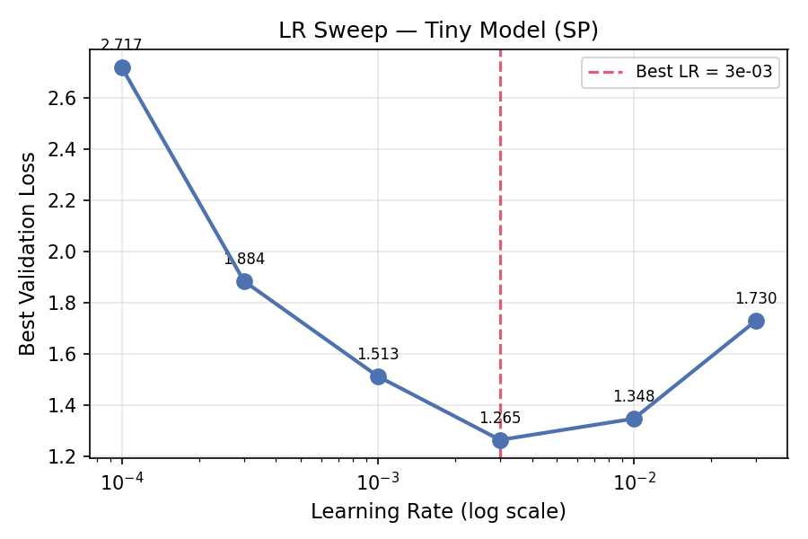
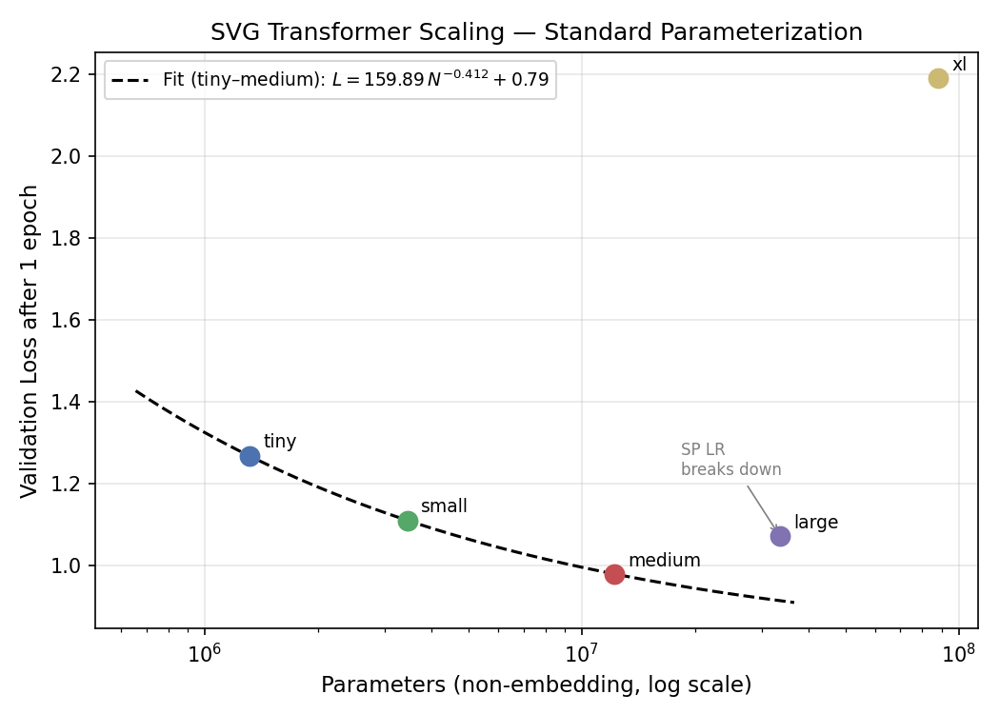
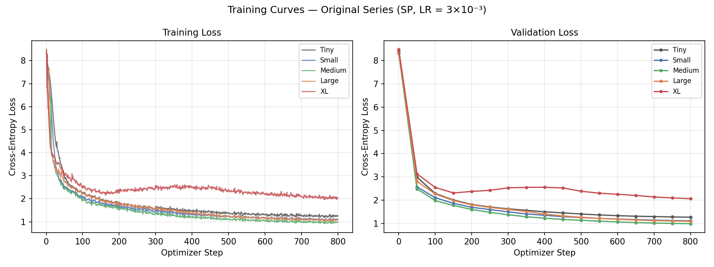

# Part 2: Transformer Scaling Study — Results

## Model Architectures

### Original Series (width + depth scale together)

| Name   | ~Params (non-emb) | d_model | n_layers | n_heads | d_ff |
|--------|-------------------|---------|----------|---------|------|
| Tiny   | 1.31M             | 128     | 4        | 4       | 512  |
| Small  | 3.44M             | 192     | 6        | 6       | 768  |
| Medium | 12.19M            | 384     | 6        | 6       | 1536 |
| Large  | 33.57M            | 512     | 10       | 8       | 2048 |
| XL     | 88.10M            | 768     | 12       | 12      | 3072 |

### Wide Series (width only — n_layers fixed at 4, designed for µP LR transfer)

| Name        | ~Params (non-emb) | d_model | n_layers | n_heads | d_ff |
|-------------|-------------------|---------|----------|---------|------|
| Tiny        | 1.31M             | 128     | 4        | 4       | 512  |
| Small-Wide  | 2.56M             | 192     | 4        | 6       | 768  |
| Medium-Wide | 8.65M             | 384     | 4        | 6       | 1536 |
| Large-Wide  | 14.68M            | 512     | 4        | 8       | 2048 |
| XL-Wide     | 31.46M            | 768     | 4        | 12      | 3072 |

µP's LR multipliers correct for width only (1/d_model scaling). Because the wide series fixes depth, the LR found on Tiny transfers zero-shot to all wider models. The original series mixes depth and width changes, which muddies µP's guarantees.

Parameter counts exclude positional embeddings (Kaplan et al. 2020 convention).

---

## Training Setup

| Setting | Value |
|---------|-------|
| Tokenizer | BPE, vocab = 4,096, ByteLevel (Part 1) |
| Context window | 1,024 tokens |
| Training tokens | 105,051,506 (1 epoch) |
| Effective batch | 131,072 tokens/step (32 seq × 4 grad_accum × 1,024) |
| Optimizer | AdamW (β₁=0.9, β₂=0.95, wd=0.1) |
| LR schedule | Cosine with 5% linear warmup (40 steps), min_lr = lr × 0.1 |
| Optimizer steps | 801 per model |
| Mixed precision | fp16 (AMP) |
| Hardware | Tesla T4 (15.6 GB VRAM) |

---

## Learning Rate Sweep (Tiny model)

6 learning rates tested on a log scale:

| LR | Best Val Loss |
|----|--------------|
| 1×10⁻⁴ | 2.717 |
| 3×10⁻⁴ | 1.885 |
| 1×10⁻³ | 1.513 |
| **3×10⁻³** | **1.265 ← best** |
| 1×10⁻² | 1.348 |
| 3×10⁻² | 1.730 |

**Selected LR: 3×10⁻³** — clear valley at this value; both larger and smaller LRs are worse. Used unchanged for all model sizes per Part 2 protocol (standard parameterization, fixed LR).

---

## Scaling Results

| Name   | Params (non-emb) | Best Val Loss | Wall Time | Tok/s   | VRAM  |
|--------|------------------|---------------|-----------|---------|-------|
| Tiny   | 1.31M            | 1.269         | 4.8 min   | 434,000 | 0.31 GB |
| Small  | 3.44M            | 1.111         | 10.0 min  | 219,000 | 0.34 GB |
| Medium | 12.19M           | **0.980**     | 20.4 min  | 112,000 | 0.49 GB |
| Large  | 33.57M           | 1.072         | 47.9 min  | 49,000  | 0.84 GB |
| XL     | 88.10M           | 2.191         | 93.0 min  | 26,000  | 1.72 GB |

> **Note on VRAM column:** these values were measured with `torch.cuda.memory_allocated()`, which only counts live tensors and understates true usage. Fixed to `torch.cuda.memory_reserved()` (matches PyTorch's memory pool, closer to Colab resource monitor). The XL model's actual usage was ~12–14 GB as observed in Colab.

### Observations

**Tiny → Small → Medium:** Loss decreases monotonically (1.269 → 1.111 → 0.980), consistent with standard scaling law behavior. A power law fit L = a·N⁻ᵅ + c on these three models gives a reasonable curve.

**Medium → Large → XL:** Loss increases (0.980 → 1.072 → 2.191). This is the expected failure mode of Standard Parameterization (SP) with a fixed LR: the LR tuned on Tiny (3×10⁻³) is too large for wider models. Under SP, optimal LR scales roughly as 1/d_model, so the LR that works for d=128 is 6× too high for d=768. This causes poor or unstable convergence for Large and XL within a single epoch.

This breakdown motivates Part 3, where µP enables zero-shot LR transfer across model widths.

---

## Power Law Fit (Tiny–Medium subset)

Fitting L = a·N⁻ᵅ + c on the three monotone models (Tiny, Small, Medium):

| Parameter | Value | Interpretation |
|-----------|-------|----------------|
| a | 159.9 | amplitude |
| **α** | **0.412** | scaling exponent |
| c | 0.789 | estimated irreducible loss |

α = 0.41 is substantially steeper than the α ≈ 0.07–0.08 reported by Kaplan et al. (2020) for natural language. SVG is a highly structured, syntax-constrained domain — models benefit more from scale on this data than on free-form text.

Note: with only 3 points and 3 free parameters the fit is exact (zero residuals); uncertainty estimates are not meaningful. The fit is restricted to Tiny–Medium since Large and XL deviate from the SP scaling trend due to LR mismatch. Part 3 (µP) provides a full 5-point monotone curve.

---

## Training Curves

All models trained from scratch with cosine LR decay. Tiny, Small, and Medium show smooth monotone loss reduction throughout training. Large shows slower improvement; XL plateaus early and barely decreases, consistent with the LR being far from optimal for that width.

---

## Design Decisions

| Decision | Choice | Justification |
|----------|--------|---------------|
| Architecture | Decoder-only GPT (nanoGPT) | Standard for autoregressive LM; well-understood scaling behavior |
| Bias | False | Fewer parameters; no quality difference observed |
| Attention | Flash Attention (PyTorch 2.0) | Memory-efficient; no change in forward semantics |
| Batch size | 131,072 tokens/step | Consistent across all models for fair comparison |
| Fixed LR | 3×10⁻³ for all models | Part 2 protocol (SP); failure at large scale motivates µP in Part 3 |
| Epochs | 1 | Required by spec; enables direct scaling law comparison |
